# Vet Shop Specification

Use Java or C# to design and implement a desktop application for Veterinary Lab. The application should have two types of users (a regular user - the doctor/employee - and an administrator user) which have to provide a username and a password in order to use the application.
The regular user can perform the following operations:
CRUD on consultations
CRUD on animals involved in consultations
Search the list of consultations/animals
The administrator can perform the following operations:
CRUD on animals
CRUD on regular users' information.
Generate two types of report files, one in pdf format and one in txt or html format, with the consultations details. The reports need to be saved in a user-selected location (not predefined by the application), similar on how one would save a file from Notepad.

# Elaboration – Iteration 1.1

## Domain Model
The Domain Model creates a web of interconnected objects, where each object represents some meaningful individual, whether as large as a corporation or as small as a single line on an order form.
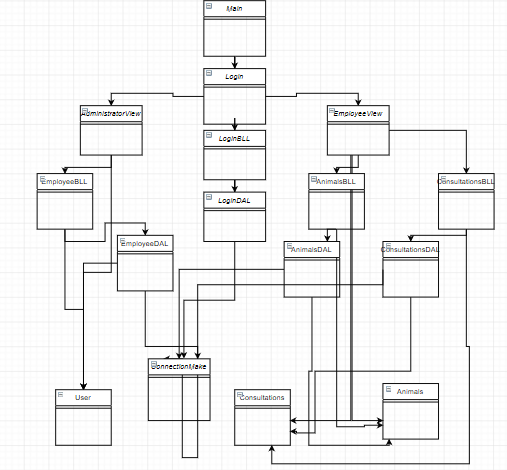

## Architectural Design

### Conceptual Architecture
[Define the system’s conceptual architecture; use an architectural style and pattern - highlight its use and motivate your choice.]
The architectural pattern used in this project is the most common one- layered architure pattern(3-tier architecture pattern in this case).Components within the layered architecture pattern are organized into horizontal layers, each layer performing a specific role within the application(presentation-GUI,business logic,data access).This way, each layer of the layered architecture pattern has a specific role and responsibility within the application. As a request moves from layer to layer, it must go through the layer right below it to get to the next layer below that one.

### Package Design
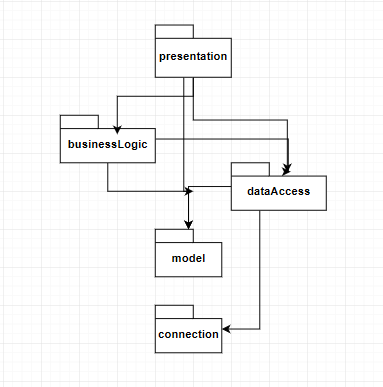

### Component and Deployment Diagrams
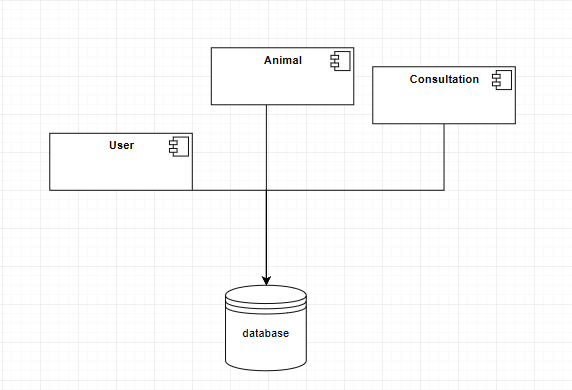

# Elaboration – Iteration 1.2

## Design Model

### Dynamic Behavior
sequence 
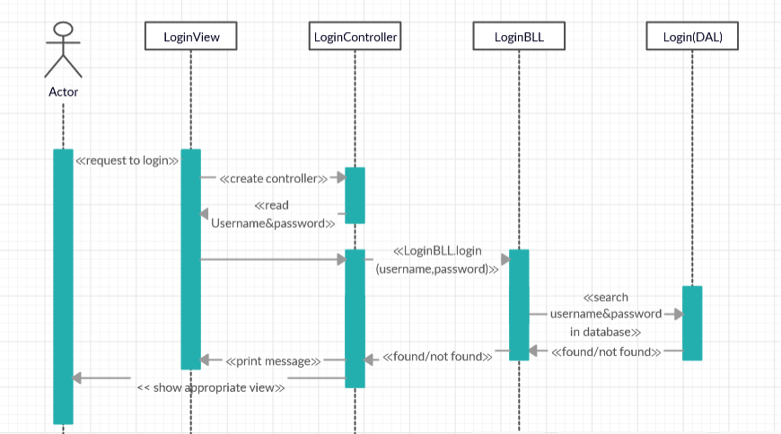

and 

communication 
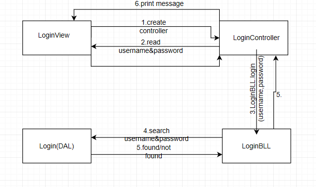 

diagrams for login scenario.

### Class Design
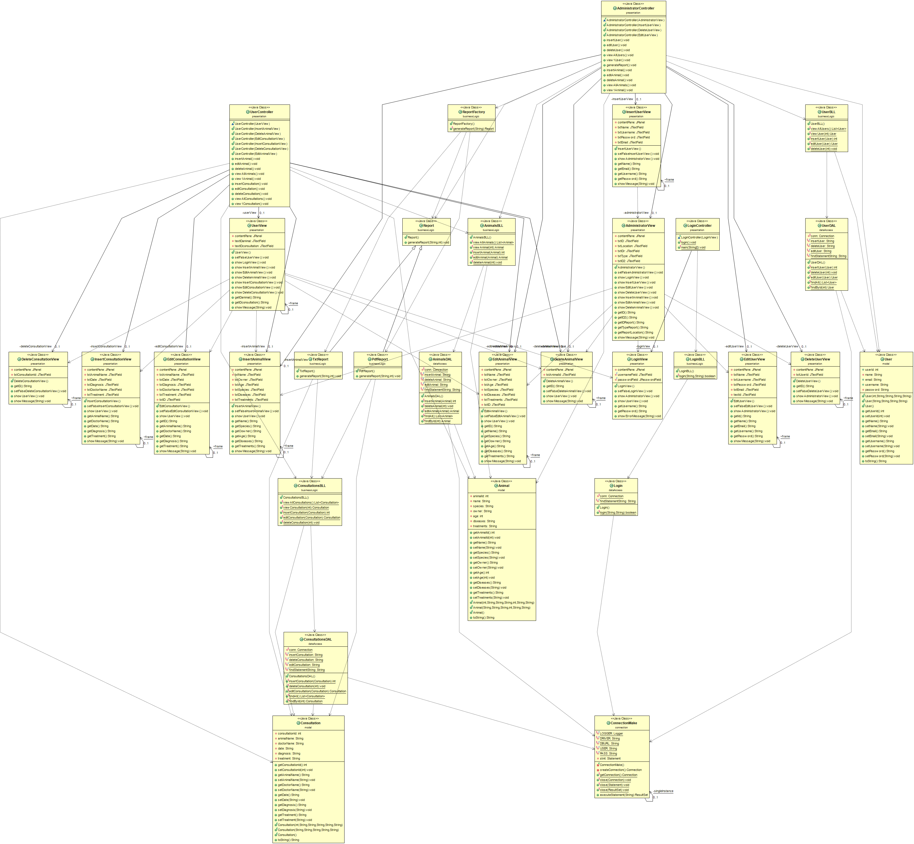

### Data Model
Relational Data Model is a type of model that designs the data in the form of rows and columns within a table. It's a model that uses tables for representing data and in-between relationships. Java Classes from the domain model are based on the tables created in database to store the data: user, animals &consultations and their attributes are mapping the tables' columns.

### Unit Testing

# Elaboration – Iteration 2

## Architectural Design Refinement
[Refine the architectural design: conceptual architecture, package design (consider package design principles), component and deployment diagrams. Motivate the changes that have been made.]

    In addition to organizing the architecture by dividing it into layers, the MVC(Model-View-Controller) pattern was also used in order to separate the input, processing, and output of an application. In this way, the code is divided into three interconnected parts called the model, the view, and the controller which are built to handle some specific development aspects of the application development.
Thus the controller receives the requests for the application and then instructs the model to prepare any information required by the view. The view uses that data prepared by the controller to bring the final output. This mode of operation can be best observed within Assignment 2 which was centered on the MVC type organization.
    During the development of the application for Assignment 3 -started from the previous application, done as assignment 2, the client and server concepts were defined transform the application into a client-server one. Following this transformation, the client can only retrieve the data by communicating with the server which contains most of the business logic. It does so by sending messages that are  received and processed by the server, which returns the corresponding response to them. Multiple clients can be connected to the same server at a given time and for each of them the server starts a new thread and also keeps the evidence of logged clients in a hashmap for later use. To represent the connection between client side and server side Socket and ServerSocket objects were used.

 ### Package Design
 
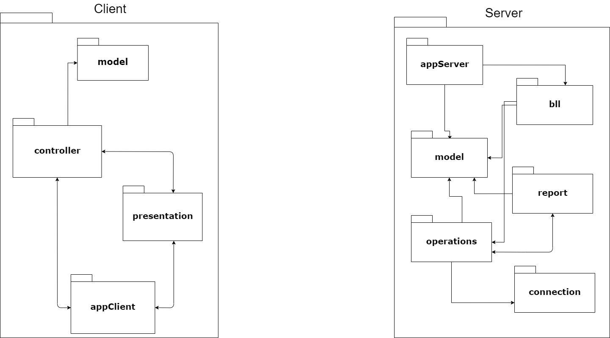

The changes compared to the previous package diagram consist in adding some packages containing the necessary classes to fulfill the new required functionalities (appClient, appServer, consultations report generator) and their division on client and server side which share the model package because both sides use objects that map on the database table(animal, consultation, user, stock).

### Component and deployment Diagrams

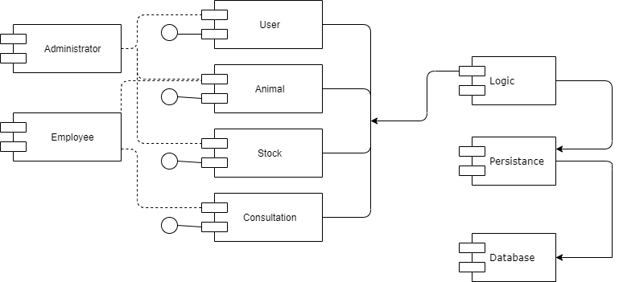

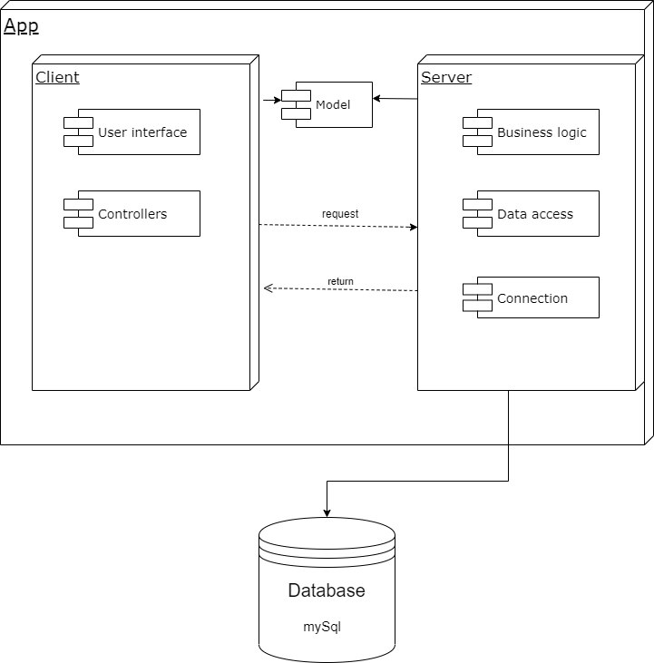

  Deployment and component diagrams provide an image on the structure of the management system of a vet clinic, this being the role of the present application. They make visible that the user as a client is server dependent in order to perform the desired operations, but also the fact that the model classes are used by both sides in the process, a process that also requires a connection to the database from the server. 
  
  The client side includes the presentation layer -the user interface that makes possible the aministrator/employee's interaction with the application, the model classes which are required in representing the data stored in the database, some controllers to respect the mvc structure by decoupling between responsabilities and the class that reprezents the client(as admin or regular user) dealing with the connection to the server and handling its response messages. 
  
  On the other side, the server is the one that receives the request from the client -including the connection one besides the ones regarding the application's features, starts a new thread for each clients that connects to it and processes the intercepted messages. As has been said, the server also has acces to the model classes which are indispensable. Here are implemented the logic and the persistence layers(bll,operations(dao)) that make possible fulfilling the required tasks including the ones regarding the consulations, the animals, the users, the reports generated when asked. This is where the connection to the mySql database is realized, implemented with the singleton design pattern, ensuring the efficiency of the application by creating a single instance of the connection.

## Design Model Refinement

Considering the complexity of the project and implicitly of the class diagram, I chose to make, besides the class diagrams for the two main parts (server and client), class diagrams in portions in order to be easier to follow and understand the connections between classes. Diagram refinement is intuitive, and applicable to several kinds of UML diagrams (mostly to structural diagrams but also to use case diagrams), yet it rests on a solid mathematical basis. 

Class Diagram for the Client side:
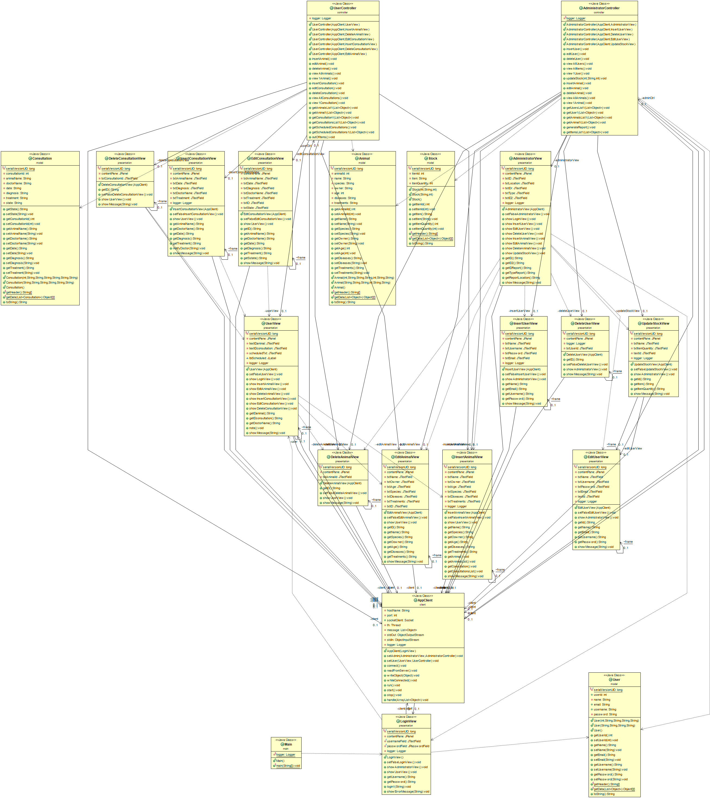

Class Diagram for the main flow starting from Main class - controllers, main frames & AppClient class:
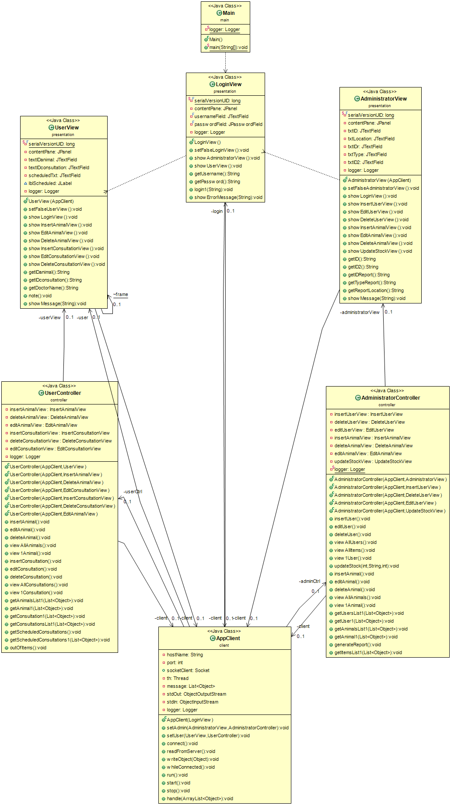

Class Diagram for the Server side:
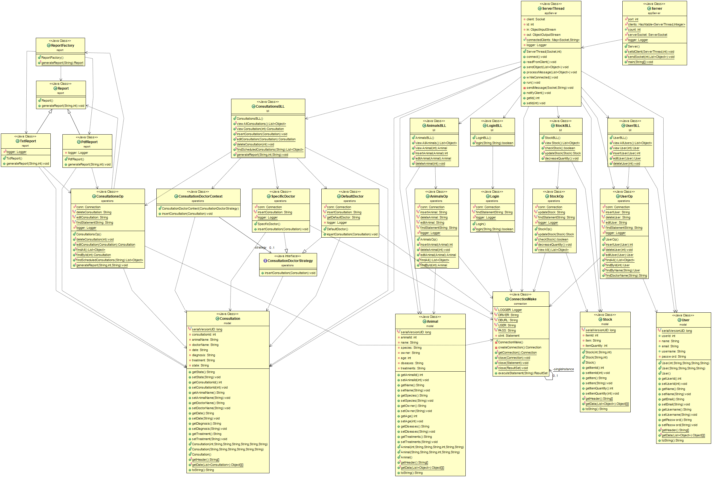

Class Diagram for the logic & persistence layers:
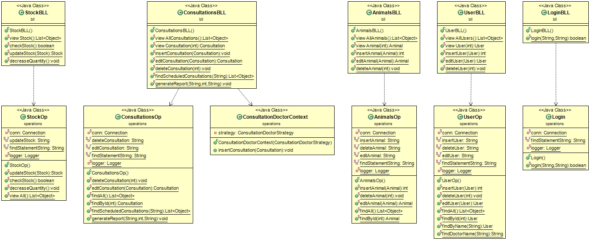

Class Diagram for the persistence layer + connection to DB:
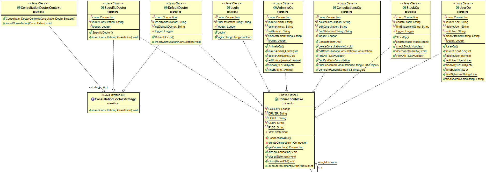

Class Diagram for the flow linked to the consultations operations - CRUD(insert consultation using Strategy), generate reports-txt/pdf:
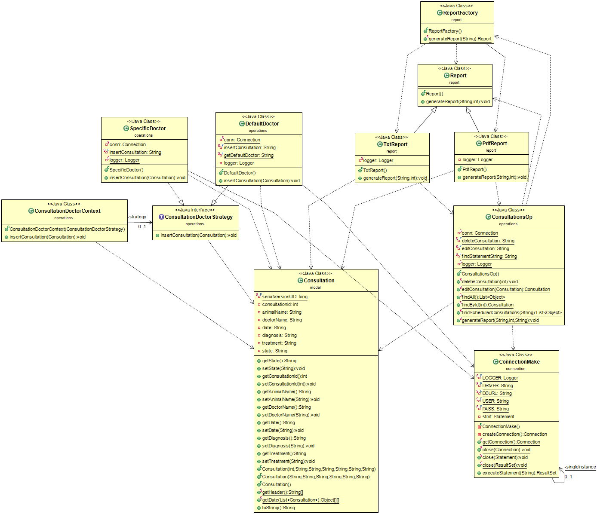

# Construction and Transition

## System Testing

Integration testing represents testing in which individual software modules are combined and tested as a group. It occurs after unit testing and before validation testing. Integration testing takes as its input modules that have been unit tested, groups them in larger aggregates, applies tests defined in an integration test plan to those aggregates, and delivers as its output the integrated system ready for system testing. It determines if independently developed units of software work correctly when they are connected to each other.

For the database operations is used JUnit test and for the entire application functionality can be used UI controls to verify if the flow of operations is correct. For example, it can be tested the entire flow for a CRUD operation starting from the UI and then checking whether the table in the database has been updated.

## Future improvements

The system can be extend to have more functionalities:

- make consultations specific depending on the breed of the animal, on whether it is its first consultation at the clinic or it has a medical history
- present in a friendly way the offers related to consultations  
- notifies user on the day when the consultation is scheduled
- add characteristics to both animals and consultations
- make the application open to the pet's owners so that they can benefit from preliminary online consultations so that the doctors have a more specific idea about theseverity of the animal's problem
- a nicer graphical interface, related to the theme of the application
- the possibility of creating a loyalty card for animals that always choose the same cabinet
- extension of services to the grooming area and their association with the regular consultations

# Bibliography
- [Architectural Styles](https://docs.microsoft.com/en-us/azure/architecture/guide/architecture-styles/)
- [Architectural Patterns and Styles](https://msdn.microsoft.com/en-us/library/ee658117.aspx)
- [Design Patterns](https://sourcemaking.com/design_patterns)
- [Online diagram drawing software](https://yuml.me/) ([Samples](https://yuml.me/diagram/scruffy/class/samples))
- [Yet another online diagram drawing software](https://www.draw.io)
